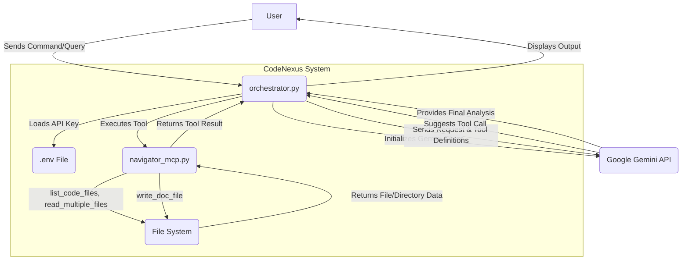

# CodeNexus Architecture

## 1. System Overview

CodeNexus is an AI Repo-Architect designed to analyze and interact with codebase repositories. It leverages Google's Generative AI (Gemini) as its core reasoning engine, orchestrating various file system tools to understand, assess, and document software projects.

## 2. Data Flow Diagram

## 3. Component Breakdown

*   **User**: Initiates queries and receives analysis from CodeNexus.
*   **orchestrator.py**: The "brain" of CodeNexus.
    *   Loads `GOOGLE_API_KEY` from `.env`.
    *   Initializes `genai.Client` and configures the Gemini model.
    *   Defines system and architectural instructions for the AI.
    *   Manages the conversation flow with the Gemini API.
    *   Identifies and executes tool calls requested by the Gemini model.
    *   Passes tool results back to Gemini for further reasoning.
    *   Outputs Gemini's final analysis to the user.
*   **.env File**: Stores environment variables, specifically the `GOOGLE_API_KEY`.
*   **Google Gemini API**: The generative AI model that processes user requests, interprets system instructions, calls available tools, and provides architectural insights and analysis.
*   **navigator_mcp.py**: Contains the core file system interaction tools, exposed via a FastMCP server.
    *   `list_code_files(path)`: Recursively lists files in a directory, intelligently skipping irrelevant folders (`venv`, `.git`, etc.) and including relevant code/config files.
    *   `read_multiple_files(file_paths)`: Reads the content of specified files, providing detailed error handling for various scenarios (e.g., `FileNotFoundError`, `PermissionError`, `UnicodeDecodeError`).
    *   `write_doc_file(filename, content)`: Writes markdown content to a specified `.md` file, with a safety check to ensure only markdown files are created/updated.
*   **File System**: The project directory where code files are stored and documentation files are written.

## 4. Day 3 Progress Summary

Day 3 was focused on solidifying the core architecture and enhancing the functional capabilities of CodeNexus, particularly in its ability to interact with the file system and generate documentation.

*   **Robust Orchestration**: The `orchestrator.py` script was significantly developed to act as the central control unit. It now seamlessly integrates with the Google Gemini API, manages API key loading from `.env`, and dynamically invokes the `navigator_mcp.py`'s tools based on AI directives. This provides a clear separation of concerns and a scalable foundation for future enhancements.
*   **Advanced File Navigation and Reading**:
    *   The `list_code_files` tool in `navigator_mcp.py` was refined to efficiently list relevant code and configuration files while intelligently ignoring common development-specific directories. The inclusion of `.env` files in listings is a crucial step for comprehensive security and configuration analysis.
    *   The `read_multiple_files` tool was implemented with detailed error reporting, allowing CodeNexus to gracefully handle and report issues like missing files, permission problems, or incorrect encodings. This richer feedback enhances the AI's reasoning capabilities.
*   **Documentation Generation**: A new `write_doc_file` tool was introduced, empowering CodeNexus to create and update markdown documentation directly within the project. This feature is vital for enabling the AI to autonomously document architectural designs, security findings, and technical debt. A built-in safeguard ensures that only `.md` files can be written, preventing accidental modification of source code.
*   **Security & Technical Debt Review**:
    *   The `GOOGLE_API_KEY` is correctly loaded from `.env`, which is a good practice for separating credentials. However, it was noted that the key itself is hardcoded within the `.env` file, which, while acceptable for development, would require more robust secret management in a production environment.
    *   Minor technical debt includes a commented-out function in `navigator_mcp.py` and some hardcoded configurations (`model_id`, loop limits) in `orchestrator.py`. These do not impede current functionality but represent areas for potential future refactoring towards more dynamic configuration.

In summary, Day 3 successfully established a more structured and capable CodeNexus. The system can now intelligently navigate, read, and write documentation within a codebase, paving the way for sophisticated architectural analysis and autonomous project documentation.