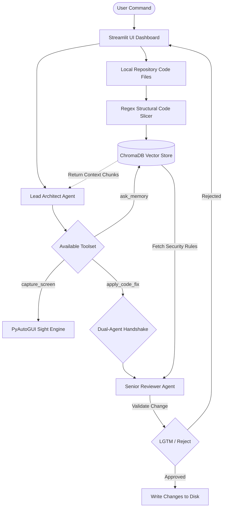

# CodeNexus: Autonomous Multi-Agent Repository Workspace

CodeNexus is an interactive, visual AI engineering cockpit built to autonomously comprehend, modify, and audit local software repositories. By leveraging a local vector knowledge layer alongside an isolated dual-agent evaluation loop, the system can safely reason over entire codebases, apply precise software fixes, and validate its actions against absolute system constraints.

## Project Overview

Reviewing, auditing, and maintaining large codebases manually introduces massive developer overhead and cognitive fatigue. This project resolves that challenge by creating a local desktop automation companion. 

The system initializes a background file ingestion stream that breaks down code files into structural blocks, indexes them semantically into a vector database, and deploys a multi-agent orchestration tree. When commanded, the Lead Architect can search memory, analyze code flows, write direct fixes, and execute programmatic tasks locally while a separate Safety Auditor validates every file mutation before it hits your disk.

## Features

* **Local Workspace Automation:** Reads, writes, and opens local project directories directly over the host OS.
* **Stateless Repository Ingestion:** Seamlessly streams and unpacks project source files into isolated storage boundaries using zip archives.
* **Semantic Code Memory:** Uses a structural code slicer to index file logic blocks natively inside a local ChromaDB vector store.
* **Dual-Agent Handshake Loop:** Employs an Architect Agent for problem-solving and a Senior Reviewer Agent for real-time code auditing.
* **Multi-Modal Contextual Inputs:** Supports processing external image layers, logs, and screenshots directly alongside structural text prompts.

## Technologies Used

* Python
* Streamlit
* Google GenAI SDK (Gemini 3.1 Flash-Lite)
* ChromaDB
* PyAutoGUI
* Git / Subprocess Utilities

## 🏗️ System Architecture

The application is built on three core pillars: An ingestion/memory pipeline, a multi-sensory UI cockpit, and an agentic execution handshake layer.


## Installation

Follow these steps to run the project locally.

### 1. Clone the Repository

```bash
git clone https://github.com/bunnny12345/CodeNexus.git
```

### 2. Navigate to the Project Directory

```bash
cd CodeNexus
```
### 3. Initialize and Activate the Virtual Environment

```PowerShell
# On Windows PowerShell:
python -m venv venv
Set-ExecutionPolicy -ExecutionPolicy RemoteSigned -Scope Process
& ".\venv\Scripts\Activate.ps1"

# On Mac / Linux:
python3 -m venv venv
source venv/bin/activate
```

### 4. Install Dependencies

Install the required libraries using:

```bash
pip install -r requirements.txt
```
### 5. Configure Your Local Environment Matrix

Create a .env file inside the root directory and append your secure API credentials:

GEMINI_API_KEY=your_google_gemini_api_key_here

GITHUB_CLIENT_ID=your_oauth_app_client_id_here

GITHUB_CLIENT_SECRET=your_oauth_app_client_secret_here

---

## Running the Project

Run the main Python script:

```bash
streamlit run app_ui.py
```

### Steps

1. The cockpit dashboard layout boots up natively inside your web browser.
2. Enter any targeted public or authorized repository URL inside the Remote Repository Target module field.
3. Click 🚀 Analyze External Repository to stream, unzip, and semantically seed the repository database context.
4. If running on localhost, the workspace agent will automatically launch an active instance of VS Code targeting the newly compiled directory tree footprint.
5. Enter software development prompts inside the text console to command the Architect to analyze logic maps, search databases, or patch workspace files cleanly.

---

## Project Structure

```
CodeNexus
│
├── app_ui.py             # Main Streamlit Dashboard Application UI
├── memory_engine.py      # ChromaDB Chunking, Vector Embeddings, & Retrieval Layer
├── navigator_mcp.py      # Downstream Local File Operations & GitHub Sync Managers
├── seed_memory.py        # Baseline Prompt Templates & System Guidelines Initialization
├── .nexus_history/       # Local JSON Transaction State Tracking Slices
├── requirements.txt      # Production Application Python Package Dependencies
└── README.md             # Systems Architectural Overview Documentation
```

## Future Improvements

* Add a dedicated visual layer tracking agent file-system updates.
* Optimize the underlying chunk token distribution density maps inside the RAG memory slicing grids.
* Integrate multi-repository crossing nodes to index separate projects simultaneously.
---
   
